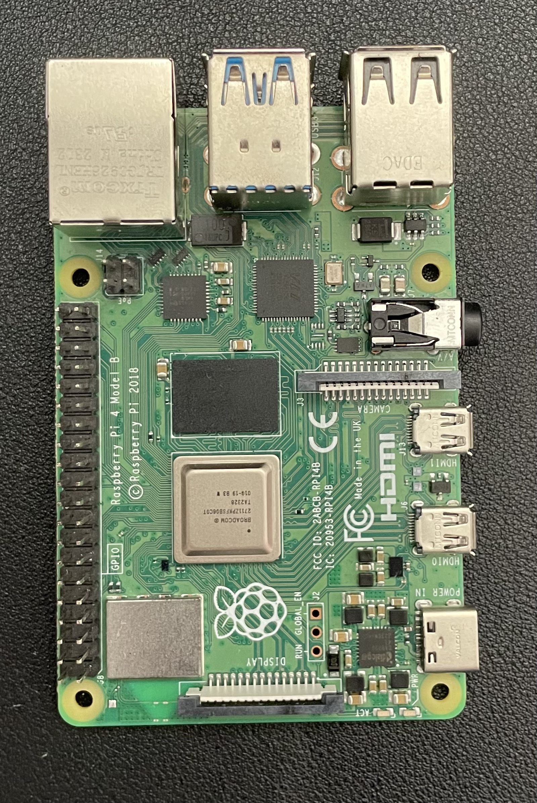
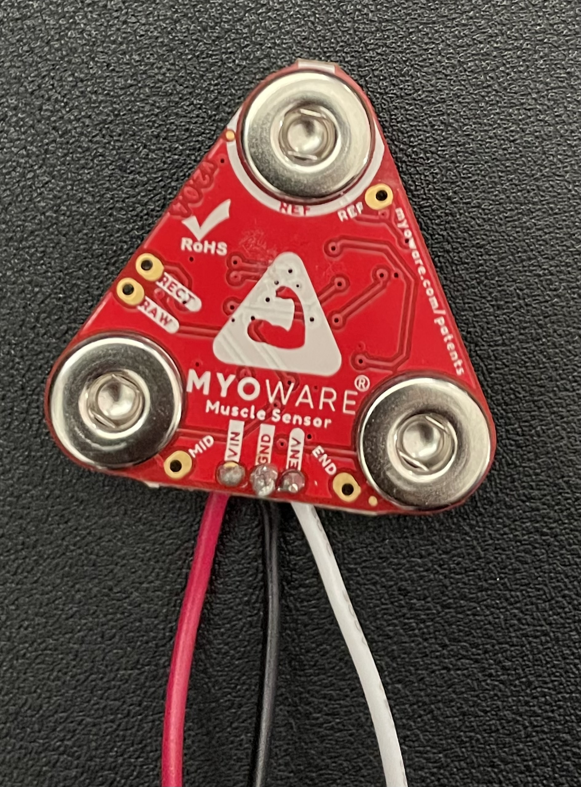
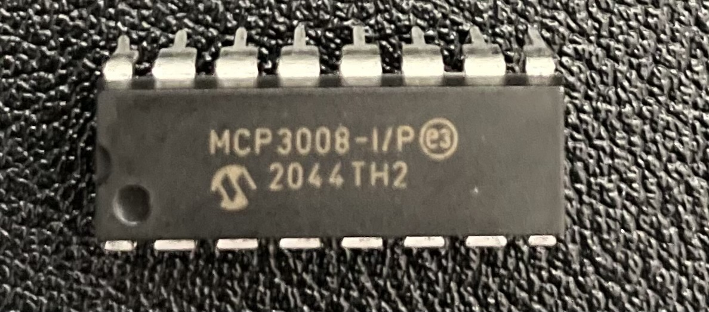
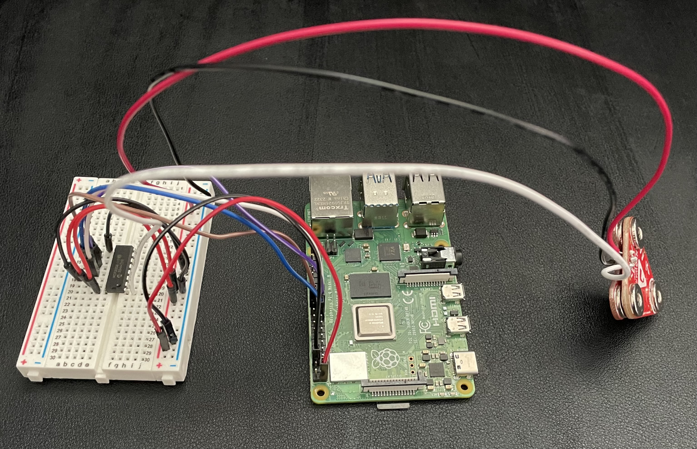

# Muscle Monitoring Web Application

## **Overview**

This project implements a real-time muscle-monitoring system using a MyoWare 2.0 Muscle Sensor (EMG) interfaced with a Raspberry Pi 4B. The system is designed to measure muscle activity and plot the data on a localhost Python-Flask web application. The system leverages the spidev library to interface with the muscle sensor using the raspberry pi. This data is continously sent in real-time to the frontend using WebSocket communication, where it is visualized using Chart.Js.

## **Built With**

- **Programming Languages:**: Python, JavaScript/HTML/CSS
- **Frameworks/Libraries**: Flask, spidev, Chart.js, Flask-SocketIO  
- **Operating System**: Linux (Raspbian)
- **HardWare (See Images Below)**: 
    - Raspberry Pi 4B
    - MyoWare 2.0 Muscle Sensor (https://www.sparkfun.com/myoware-2-0-muscle-sensor.html?gad_source=1)
    - MCP3008 ADC

## **Hardware Overview**

### Raspberry Pi 4B


### MyoWare 2.0 Muscle Sensor


### MCP3008 ADC


### Full System Setup


*Above: Complete setup showing Raspberry Pi, EMG sensor, MCP3008, and wiring.*


## **Example Schematic**
<pre>
+------------------------+                      +---------------------------+                       +--------------------------+
|  MyoWare EMG Sensor    |                      |        MCP3008 ADC        |                       |     Raspberry Pi 4B      |
+------------------------+                      +---------------------------+                       +--------------------------+
|        ENV (Signal Out)|--------------------> | Pin 1  - CH0              |                       |                          |
|               V+ (3.3V)|--------------------> | Pin 15 - VREF             | <-------------------+ | 3.3V                     |
|                     GND|--------------------> | Pin 14 - AGND             | <-------------------+ | GND                      |
+------------------------+                      | Pin 16 - VDD              | <-------------------+ | 3.3V                     |
                                                | Pin 13 - CLK              | <-------------------+ | GPIO11 (SCLK)            |
                                                | Pin 12 - DIN              | <-------------------+ | GPIO10 (MOSI)            |
                                                | Pin 11 - DOUT             | ------------------->  | GPIO9  (MISO)            |
                                                | Pin 10 - CS/SHDN          | <-------------------+ | GPIO8  (CE0)             |
                                                | Pin 9  - DGND             | <-------------------+ | GND                      |
                                                +---------------------------+                       +--------------------------+
</pre>

## **Getting Started**

Follow the steps below to install and setup the EMG system. The system uses a MyoWare 2.0 Muscle Sensor, however, in theory any sensor could be used.

### Usage

1. Enable SPI on the Raspberry Pi:
Run the following command from the termianl then navigate to Interfaces and enable SPI

```sh
sudo raspi-config 
```

2. Clone the repo

```sh
git clone https://github.com/lmitchell33/Web-EMG.git && cd Web-EMG
```

3. Create a virutal environment (required if using Raspberry Pi)

```sh
python3 -m venv venv
```

4. Start the virtual environment

```sh
source venv/bin/activate
```

5. Install Python libraries

```sh
pip install -r requirements.txt
```

6. Wire the application

```
add a schematic here
```

7. Start the application

```sh
python3 app.py
```
